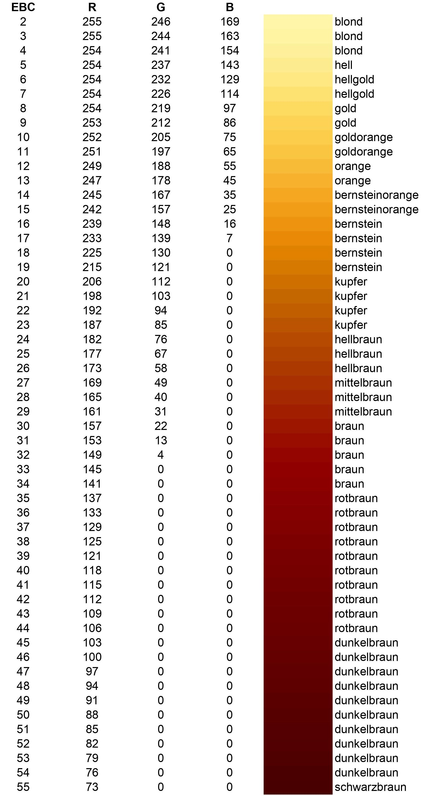
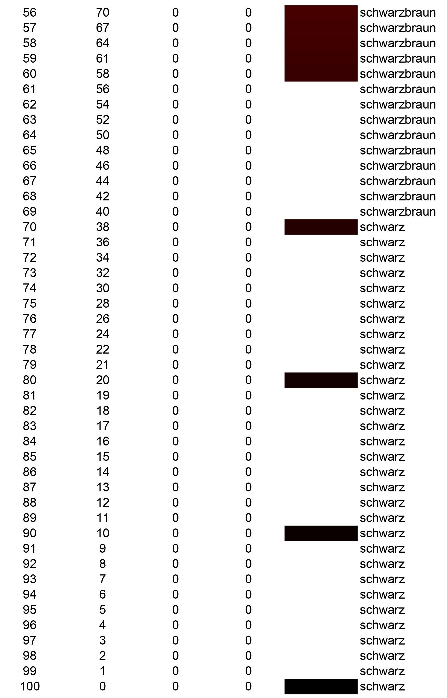

# EBC-Formula

$$ {EBC}_{total} = \left( \sum_{i=1}^n x_i * {EBC}_i \right) * {Plato \over 10} + {t_{boiling} \over 60} $$

$$ {EBC}_{total} = \left( {{1 \over m_{total}} \sum_{i=1}^n m_i * {EBC}_i} \right) * {Plato \over 10} + {t_{boiling} \over 60} $$

| Variable | Unit | Description |
| :---: | :---: | --- |
| $t_{boiling}$ | min | total boiling time of the beer wort |
| Plato | °P | density of the beer wort |
| $x_i$ |  | amount of malt i $\left( \sum x_i = 1 \right)$ | 
| $m_i$ | kg | amount of malt i $\left( \sum m_i = m_{total} \right)$ |
| $m_{total}$ | kg | total amount of malt used |

# Conversions

$$ EBC = SRM * 1.97 $$

$$ EBC = °L * 2.65 - 1.2 $$

$$ SRM = EBC * 0.508 $$

$$ SRM = \left( 1.3546 * °L \right) - 0.76 $$

$$ °L = EBC * 0.377 + 0.45 $$

$$ °L = {1 \over 1.3546} * \left( SRM + 0.76 \right) $$

# EBC color table (german)

